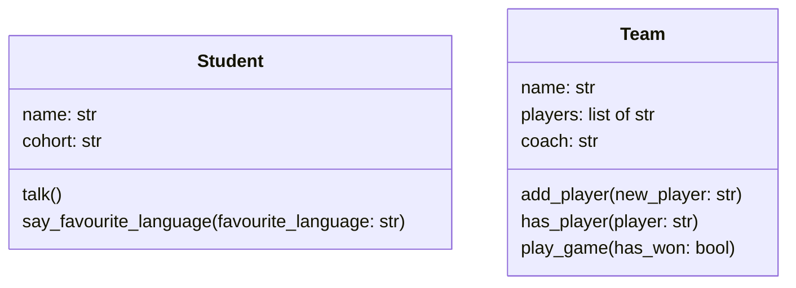

```mermaid
classDiagram

class Student {
    name: str
    cohort: str
    talk()
    say_favourite_language(favourite_language: str)
}

class Team {
    name: str
    players: list of str
    coach: str
    add_player(new_player: str)
    has_player(player: str)
    play_game(has_won: bool)
}
```