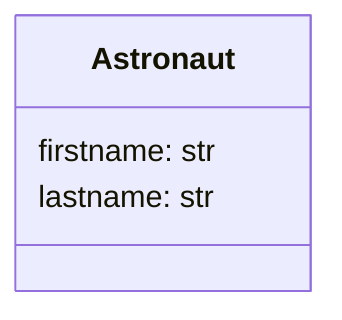
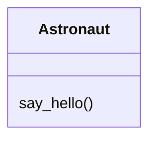
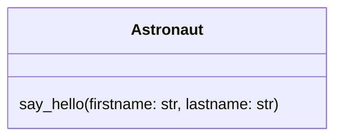
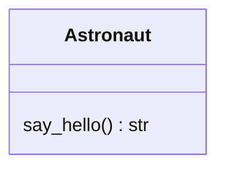

```mermaid
classDiagram

class Astronaut {
    firstname: str
    lastname: str
}
```

```mermaid
classDiagram

class Astronaut {
    say_hello()
}
```

```mermaid
classDiagram

class Astronaut {
    say_hello(firstname: str, lastname: str)
}
```

```mermaid
classDiagram

class Astronaut {
    say_hello() str
}
```