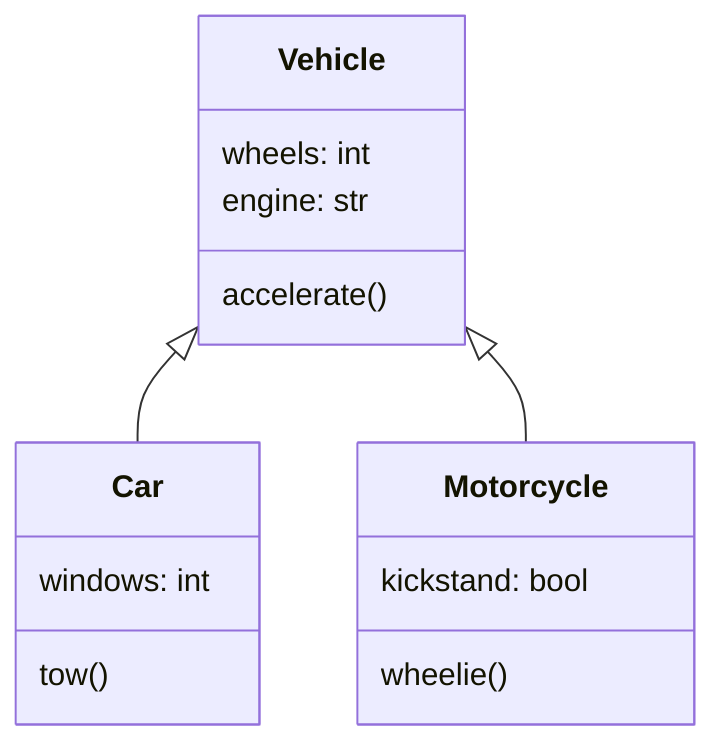

# Vehicles

```mermaid
classDiagram

class Vehicle {
    wheels: int
    engine: str
    accelerate()
}


class Car {
    windows: int
    tow()
}

class Motorcycle {
    kickstand: bool
    wheelie()
}

Vehicle <|-- Car

Vehicle <|-- Motorcycle
```