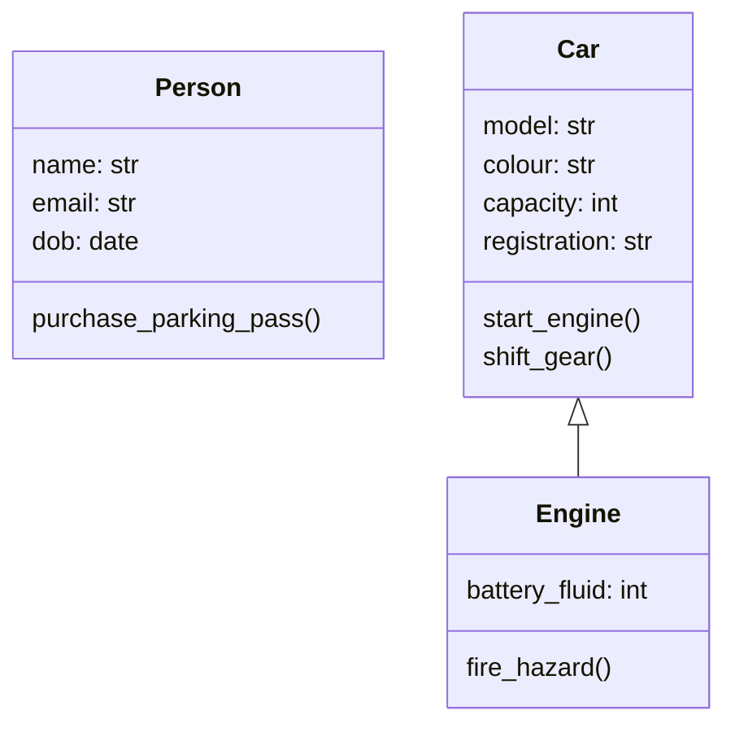

# Diagramming
## Planning is important. 
### Draw.io, Figma, etc

Based on UML (universal modelling language).
Regardless of programming language.

```mermaid
classDiagram

class Person {
    name: str
    email: str
    dob: date
    purchase_parking_pass()
}


class Car {
    model: str
    colour: str
    capacity: int
    registration: str
    start_engine()
    shift_gear()
}

class Engine {
    battery_fluid: int
    fire_hazard()
}

Car <|-- Engine
```